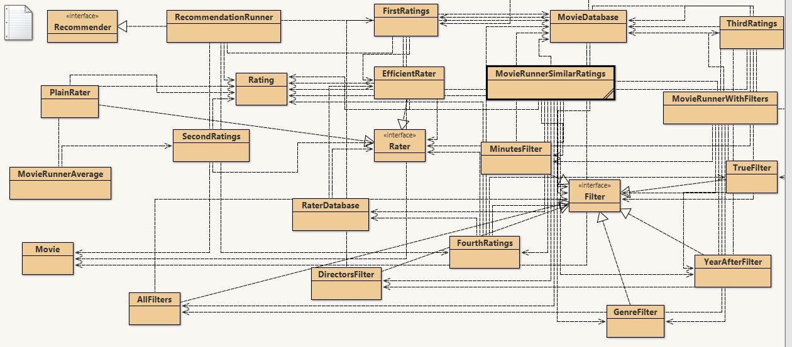
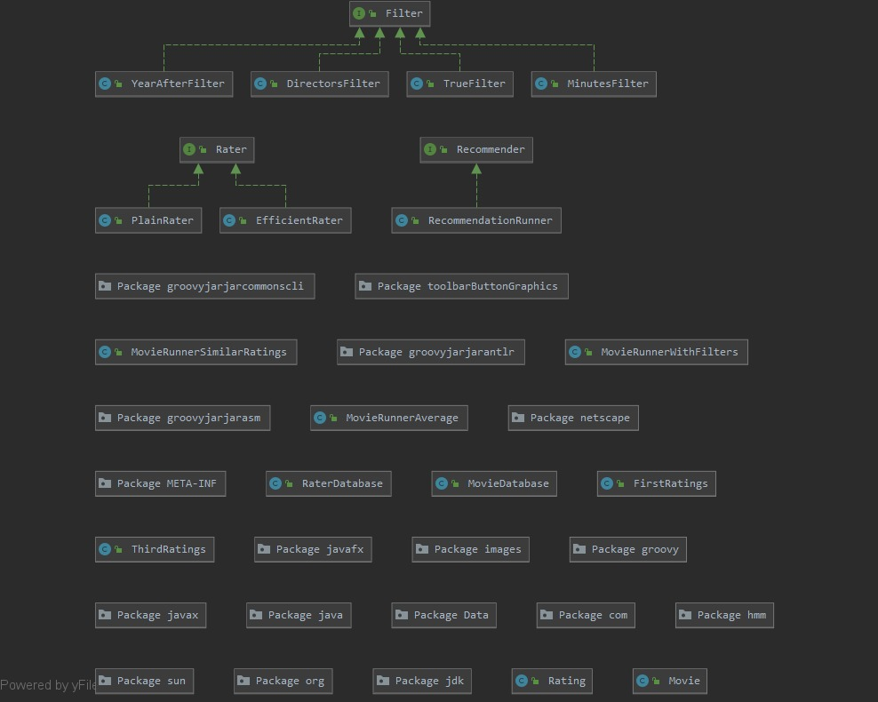
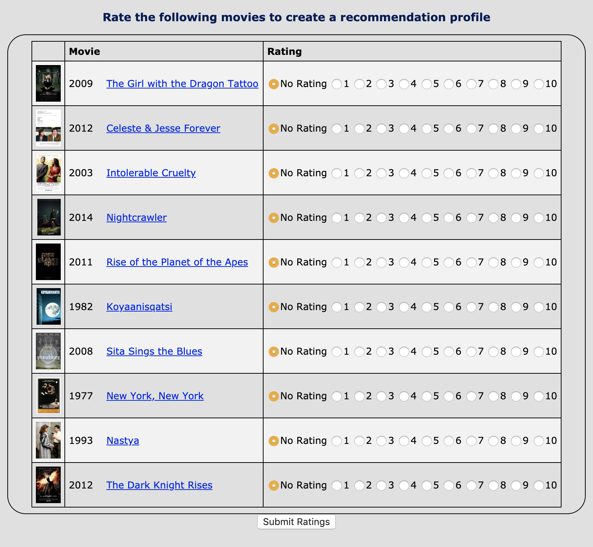

# Java-Build-a-recommendation-system

### Title of the project
*Movie Recommendation system*

**Aim of the project:** To build a system that recommends movies according to their ratings.

**Contact Person:** 

Selma Nezihoglu

0707725414

snezihoglu@gmail.com

## Description

It is the project of Coursera's Java programming "Build a recommendation system" course.

Here we are asked for building a capstone project by taking a look at the features of a recommender engine. I chose how to read in and organize user, ratings, and movie data in my program. 

In this capstone, I wrote code to recommend movies based on different criteria, criteria based on user ratings of those movies.

The person who runs the project will be able to make recommendations by filtering based on genre, or co-stars, or by any other criteria.

I designed and wrote classes to implement a recommendation engine that makes recommendations along the lines we've just discussed. My program could make recommendations from many sources. Food, movies, books, or more. It just depends on the data that you read in.

### Let me give you a detailed description about what I did

So basically I devided my project into five parts:

#### First Step

I created a sequence of recommendation programs as part of this capstone. The first step in creating programming recommendations was to get data about the items that can form the basis of the recommendations my program will generate. I wrote programs to read the data into structures so that my program can access and process to make recommendations. Although I won't using Yelp or Netflix data to generate my recommendations, I am using Twitter data about movie recommendations, to write my own recommender program. I am using recommendations for movies that have come from Twitter posts, via a project called MovieTweetings. 

The data I used is stored in CSV files. 

I read the data and store the rating movie data in collections my program will access to create recommendations. I started with simple storage techniques, and as I started creating more sophisticated recommendations, I used more efficient data structures, using the software design principles I've learned in the specialization that Coursera provided.

I used Plain Old Java Object, or POJO, to store the movie data. The movie.java class mirrors the CSV file storing the movie data.

That CSV file contains one line of comma separated value data for each movie. Each line of the CSV file stores eight items of information about each movie. The first item is an IMDB or internet movie data base ID number, for the movie. The title of the movie is the next one on the line, followed by the year in which the movie was made, a country in which the movie was made, though sometimes there is more than one country. Then the genre of the movie, such as comedy, action, adventure, horror or more. There can also be more than one genre listed with the movie.

Then there are the movie's directors, followed by the length of the movie in minutes. I read the CSV file and use the POJO class that Coursera created, to store data for each movie. The **Movie.java** class has a constructor and several getter methods for accessing data about the movie. Once a movie object is created it doesn't change. The get methods include, get title, get I.D., get year and more to access information about each movie. I read this data using the edu.duke file resource class and the Apache CSV parser.

Another CSV file will store ratings for many movies. These ratings have been curated from the Twitter posts. Each line in the CSV file stores data for one rating, that is one rater on Twitter writing about a specific movie. Each line stores an ID for the person creating a rating, the IMDB Movie ID for the movie being rated, and the rating given to the movie on a scale of one to ten. The CSV file also stores information about the date and time, but we won't use that number in the recommendations you'll be creating.

The Movie ID is the key in obtaining information about the movie being rated. It is used in the data structure i created, when reading the movie CSV file I've already discussed. The Rater class supports several operations, so it's more complex than a POJO, which would support only simple get operations. We are able to determine if the rater has provided a rating for a specific movie, that's a parameter to a boolean method, has rating. We are able to obtain the rating for a movie specified by a movie I.D., using the method get rating, that returns a double. We are also able to add a rating, which you might do when reading the rating data CSV file, for example.

I have all the Movie IDs rated to iterate over all movies with ratings, see the Rater.java class file for details. Let's summarize the three classes I used to read and store data to create recommendations. I used Movie.java, Rater.java and Rating.java in creating programmatic recommendations, by reading CSV files and storing data in ArrayLists in this first part of the capstone project.

The Rater.java class stores movie ratings for one rater. This might be ratings from several movies.

Each of these rating objects stores the movie ID and the rating for that movie in an instance of the rating.java class. This makes both movie.java and rating.java POJO classes.

Each has a constructor to create an object and get methods to access information about the movie or the rating.

The Rater.java class supports queries about ratings made by one rater, like what movies have been rated, and what the rating for a specific movie is. That's an overview of the first part of the capstone project.

***Movie.java***
The class Movie is a Plain Old Java Object (POJO) class for storing the data about one movie. It includes the following items:

Eight private variables to represent information about a movie including:

* id - a String variable representing the IMDB ID of the movie
* title - a String variable for the movie’s title
* year - an integer representing the year
* genres - one String of one or more genres separated by commas
* director - one String of one or more directors of the movie separated by commas
* country - one String of one or more countries the film was made in, separated by commas
* minutes - an integer for the length of the movie
* poster - a String that is a link to an image of the movie poster if one exists, or “N/A” if no poster exists 

A constructor with eight parameters to initialize the private variables.

Eight getter methods to return the private information such as the method getGenres that returns a String of all the genres for this movie.

A toString method for representing movie information as a String so it can easily be printed.

***Rating.java***

The class Rating is also a POJO class for storing the data about one rating of an item. It includes

Two private variables to represent information about a rating:

item - a String description of the item being rated (for this assignment you should use the IMDB ID of the movie being rated)
value - a double of the actual rating

A constructor with two parameters to initialize the private variables.

Two getter methods getItem and getValue.

A toString method to represent rating information as a String.

***Rater.java***

The class Rater keeps track of one rater and all their ratings. This class includes:

Two private variables:

myID - a unique String ID for this rater

myRatings - an ArrayList of Ratings

A constructor with one parameter of the ID for the rater.

A method addRating that has two parameters, a String named item and a double named rating. A new Rating is created and added to myRatings.

A method getID with no parameters to get the ID of the rater.

A method getRating that has one parameter item. This method returns the double rating of this item if it is in myRatings. Otherwise this method returns -1.

A method numRatings that returns the number of ratings this rater has.

A method getItemsRated that has no parameters. This method returns an ArrayList of Strings representing a list of all the items that have been rated.

A compareTo method to compare this rating with another rating.

I created a class named FirstRatings to process the movie and ratings data and to answer questions about them. 

This class includes a method named loadMovies that has one parameter, a String named filename. This method processes every record from the CSV file whose name is filename, a file of movie information, and return an ArrayList of type Movie with all of the movie data from the file.

Also a void method named testLoadMovies which does the ones listed below.

  1. Calls the method loadMovies on the file ratedmovies_short.csv and stores the result in an ArrayList local variable. Prints the number of movies, and prints each movie. 
  1. Adds code to determine how many movies include the Comedy genre. 
  1. Adds code to determine how many movies are greater than 150 minutes in length. 
  1. Adds code to determine the maximum number of movies by any director, and who the directors are that directed that many movies. 
  
In the FirstRatings class, there is a method named loadRaters that has one parameter named filename. This method processes every record from the CSV file whose name is filename, a file of raters and their ratings, and return an ArrayList of type Rater with all the rater data from the file.

 Void method named testLoadRaters does these:

  1. Calls the method loadRaters on the file ratings_short.csv and stores the result in a local ArrayList variable. Prints the total number of raters. Then for each rater, prints the rater’s ID and the number of ratings they did on one line, followed by each rating on a separate line. 
  1. Adds code to find the number of ratings for a particular rater you specify in your code. 
  1. Adds code to find the maximum number of ratings by any rater. Determines how many raters have this maximum number of ratings and who those raters are. 
  1. Adds code to find the number of ratings a particular movie has. 
  1. Adds code to determine how many different movies have been rated by all these raters. 

#### Second Step

The first thing I did is to take a list of movies, see if each one has enough recommendations for a meaningful average and, if so, compute the average recommendation. 

I built on this assignment by calculating average ratings of movies. I worked with two new classes, SecondRatings which gives me parts of, and a new class MovieRunnerAverage.

In this assignment I modified a new class named SecondRatings to do many of the calculations focusing on computing averages on movie ratings. I also created a second new class named MovieRunnerAverage, which is to test the methods I created in SecondRatings by creating a SecondRatings object in MovieRunnerAverage and calling its methods.

Specifically for this assignment I wrote the following classes and methods:

  1. This class includes two private variables, one named myMovies of type ArrayList of type Movie, and a second one named myRaters of type ArrayList of type Rater.
  1. I wrote an additional SecondRatings constructor that has two String parameters named moviefile and ratingsfile. The constructor creates a FirstRatings object and then calls the loadMovies and loadRaters methods in FirstRatings to read in all the movie and ratings data and stores them in the two private ArrayList variables of the SecondRatings class, myMovies and myRaters.
  1. In the SecondRatings class, I wrote a public method named getMovieSize, which returns the number of movies that were read in and stored in the ArrayList of type Movie.
  1. In the SecondRatings class, I wrote a public method named getRaterSize, which returns the number of raters that were read in and stored in the ArrayList of type Rater.
  1. I created a new class named MovieRunnerAverage. In this class, I created a void method named printAverageRatings that has no parameters. This method creates a SecondRatings object and uses the CSV filenames of movie information and ratings information from the first assignment when calling the constructor. Prints the number of movies and number of raters from the two files by calling the appropriate methods in the SecondRatings class. Tests my program to make sure it is reading in all the data from the two files. 

In the SecondRatings class, I wrote a private helper method named getAverageByID that has two parameters: a String named id representing a movie ID and an integer named minimalRaters. This method returns a double representing the average movie rating for this ID if there are at least minimalRaters ratings. If there are not minimalRaters ratings, then it returns 0.0.

In the SecondRatings class, I wrote a public method named getAverageRatings, which has one int parameter named minimalRaters. This method should find the average rating for every movie that has been rated by at least minimalRaters raters. Stores each such rating in a Rating object in which the movie ID and the average rating are used in creating the Rating object. The method getAverageRatings returns an ArrayList of all the Rating objects for movies that have at least the minimal number of raters supplying a rating.

In the SecondRatings class, I wrote a method named getTitle that has one String parameter named id, representing the ID of a movie. This method returns the title of the movie with that ID. If the movie ID does not exist, then this method should return a String indicating the ID was not found.

In the MovieRunnerAverage class in the printAverageRatings method, adds code to print a list of movies and their average ratings, for all those movies that have at least a specified number of ratings, sorted by averages. Specifically, this method prints the list of movies, one movie per line in sorted order by ratings, lowest rating to highest rating.

In the SecondRatings class, i wrote a method getID that has one String parameter named title representing the title of a movie. This method returns the movie ID of this movie. If the title is not found, returns an appropriate message such as “NO SUCH TITLE.” 

In the MovieRunnerAverage class, I wrote the void method getAverageRatingOneMovie, which has no parameters. This method first creates a SecondRatings object, reading in data from the movie and ratings data files. Then this method prints out the average ratings for a specific movie title. 

#### Third Step

In this part of the capstone, we are able to get just specific recommendations. At the same time, I made the code more efficient for accessing movie information and rating information about movies. I used a HashMap rather than an ArrayList. This allows my program to find a movie, given its ID immediately, rather than looping through an ArrayList. In making my program more general and more efficient I used Java interfaces.

The first modification i did is to refactor the Rater.java class.

The first step in refactoring is to create an interface rather than a class.

To create an efficient rater, while minimizing other changes, I first created this interface rather than a class. I made a copy of Rater.java and call it PlainRater.java. I changed the code in that class so the constructor is named appropriately. Then I created an interface out of Rater.java by removing the method implementations leaving the interface.

I used an interface to make code efficient. I used the filter interface to get better recommendations. 

To keep things simple and efficient, I created and use a movie database class that allows efficient queries given a movie ID. This is both efficient and easy to use in our filter classes as well as by the other classes in our recommendation framework.

All the methods in the movie database class are static. So no movie database objects are created using new. Instead access to movies is provided via static methods. 

I changed the name of the class Rater.java to PlainRater.java and created a new public interface named Rater, added methods to this new interface by copying all the method signatures from the PlainRater class. I copied just the methods and didn't include the constructors or the private instance variables.I added code to PlainRater so that it implements the Rater interface.

I created a new class named EfficientRater, and copied the PlainRater class into this class. I made several changes to this class, including:

  1. Changing the ArrayList of type Rating private variable to a HashMap<String,Rating>. The key in the HashMap is a movie ID, and its value is a rating associated with this movie.
  1. Changing addRating to instead add a new Rating to the HashMap with the value associated with the movie ID String item as the key in the HashMap.

Also changed FirstRatings to use EfficientRater instead of PlainRater. 

In this part there is a class, MovieDatabase—This class is an efficient way to get information about movies. It stores movie information in a HashMap for fast lookup of movie information given a movie ID. The class also allows filtering movies based on queries. All methods and fields in the class are static. Thiswe are able to access methods in MovieDatabase without using new to create objects, but by calling methods like MovieDatabase.getMovie("0120915"). This class has the following parts:

  1. A HashMap named ourMovies that maps a movie ID String to a Movie object with all the information about that movie.
  1. A public initialize method with one String parameter named moviefile. 
  1. A private initialize method with no parameters that will load the movie file ratedmoviesfull.csv if no file has been loaded. This method is called as a safety check with any of the other public methods to make sure there is movie data in the database.
  1. A private loadMovies method to build the HashMap.
  1. A containsID method with one String parameter named id. This method returns true if the id is a movie in the database, and false otherwise.
  1. Several getter methods including getYear, getTitle, getMovie, getPoster, getMinutes, getCountry, getGenres, and getDirector. Each of these takes a movie ID as a parameter and returns information about that movie.
  1. A size method that returns the number of movies in the database.
  1. A filterBy method that has one Filter parameter named f. This method returns an ArrayList of type String of movie IDs that match the filtering criteria.

The interface Filter has only one signature for the method satisfies. Any filters that implement this interface also has this method. The method satisfies has one String parameter named id representing a movie ID. This method returns true if the movie satisfies the criteria in the method and returns false otherwise.

The class TrueFilter is used to select every movie from MovieDatabase. It’s satisfies method always returns true.

The class YearsAfterFilter is a filter for a specified year; it selects only those movies that were created on that year or created later than that year. If the year is 2000, then all movies created in the year 2000 and the years after (2001, 2002, 2003, etc) would be selected if used with MovieDatabase.filterBy.

The class AllFilters combines several filters. This class has the following:

  1. A private variable named filters that is an ArrayList of type Filter.
  1. An addFilter method that has one parameter named f of type Filter. This method allows one to add a Filter to the ArrayList filters.
  1. A satisfies method that has one parameter named id representing a movie ID. This method returns true if the movie satisfies the criteria of all the filters in the filters ArrayList. Otherwise this method returns false.

I created a new class MovieDatabase, which uses a HashMap to store movie information so that looking up that information is more efficient. This part also filters movies based on several criteria to narrow down search results. I created some new Filters as described below.

Created a new class named ThirdRatings. Copied my code from SecondRatings into this class. ThirdRatings has only one private variable named myRaters to store an ArrayList of Raters.

A second constructor has only one String parameter named ratingsfile. This constructor calls the method loadRaters from the FirstRatings class to fill the myRaters ArrayList.

I modified getAverageRatings. myMovies no longer exists. Instead, I got all the movies from the MovieDatabase class and stored them in an ArrayList of movie IDs. Thus, I modified getAverageRatings to call MovieDatabase with a filter, and in this I used the TrueFilter to get every movie.

Then for each movie ID in the ArrayList movies, I calculated its averageRating and returned an ArrayList of Ratings for each movie that was rated by minimalRaters.

Creatde a new class named MovieRunnerWithFilters that I used to find the average rating of movies using different filters. I copied the printAverageRatings method from the MovieRunnerAverage class into this class and made several changes:

  1. Instead of creating a SecondRatings object, I created a ThirdRatings object. This only has one parameter, the name of a file with ratings data.
  1. Prints the number of raters after creating a ThirdsRating object.
  1. Calls the MovieDatabase initialize method with the moviefile to set up the movie database.
  1. Prints the number of movies in the database.
  1. Calls getAverageRatings with a minimal number of raters to return an ArrayList of type Rating.
  1. Prints out how many movies with ratings are returned, then sort them, and print out the rating and title of each movie.

* In the ThirdRatings class, I wrote a public helper method named getAverageRatingsByFilter that has two parameters, an int named minimalRaters for the minimum number of ratings a movie must have and a Filter named filterCriteria. This method creates and returns an ArrayList of type Rating of all the movies that have at least minimalRaters ratings and satisfies the filter criteria. This method creates the ArrayList of type String of movie IDs from the MovieDatabase using the filterBy method before calculating those averages.
* In the MovieRunnerWithFilters class, I created a void method named printAverageRatingsByYear that is similar to printAverageRatings, but also creates a YearAfterFilter and calls getAverageRatingsByFilter to get an ArrayList of type Rating of all the movies that have a specified number of minimal ratings and came out in a specified year or later. Prints the number of movies found, and for each movie found, prints its rating, its year, and its title. 
* I created a new class named GenreFilter that implements Filter. The constructor has one parameter named genre representing one genre, and the satisfies method returns true if a movie has this genre.
* In the MovieRunnerWithFilters class, I created a void method named printAverageRatingsByGenre that creates a GenreFilter and call getAverageRatingsByFilter to get an ArrayList of type Rating of all the movies that have a specified number of minimal ratings and include a specified genre. Prints the number of movies found, and for each movie, prints its rating and its title on one line, and its genres on the next line.
* I created a new class named MinutesFilter that implements Filter. Its satisfies method returns true if a movie’s running time is at least min minutes and no more than max minutes.
* In the MovieRunnerWithFilters class, I created a void method named printAverageRatingsByMinutes that creates a MinutesFilter and calls getAverageRatingsByFilter to get an ArrayList of type Rating of all the movies that have a specified number of minimal ratings and their running time is at least a minimum number of minutes and no more than a maximum number of minutes. Prints the number of movies found, and for each movie print its rating, its running time, and its title on one line. 
* I created a new class named DirectorsFilter that implements Filter. The constructor has one parameter named directors representing a list of directors separated by commas.
* In the MovieRunnerWithFilters class, I created a void method named printAverageRatingsByDirectors that creates a DirectorsFilter and calsl getAverageRatingsByFilter to get an ArrayList of type Rating of all the movies that have a specified number of minimal ratings and include at least one of the directors specified. Prints the number of movies found, and for each movie prints its rating and its title on one line, and all its directors on the next line.
* In the MovieRunnerWithFilters class, I created a void method named printAverageRatingsByYearAfterAndGenre that creates an AllFilters object that includes criteria based on movies that came out in a specified year or later and have a specified genre as one of its genres. This method calls getAverageRatingsByFilter to get an ArrayList of type Rating of all the movies that have a specified number of minimal ratings and the two criteria based on year and genre. Prints the number of movies found, and for each movie, prints its rating, its year, and its title on one line, and all its genres on the next line.
* In the MovieRunnerWithFilters class, I created a void method named printAverageRatingsByDirectorsAndMinutes that creates an AllFilters object that includes criteria based on running time and directors. This method calls getAverageRatingsByFilter to get an ArrayList of type Rating of all the movies that have a specified number of minimal ratings and the two criteria based on minutes and directors. Prints the number of movies found, and for each movie, prints its rating, its time length, and its title on one line, and all its directors on the next line.

#### Fourth Steps

In this part of the capstone project I added a new kind of recommendation that helps me make recommendations better than using simple averages.

For this assignment I created one class RaterDatabase. This class contains: A HashMap named ourRaters that maps a rater ID String to a Rater object that includes all the movie ratings made by this rater. A public static initialize method with one String parameter named filename. A private initialize method with no parameters that initializes the HashMap ourRaters if it does not exist. A public static void addRatings method that has one String parameter named filename. A public static void addRaterRating method that has three parameters, a String named raterID representing a rater ID, a String named movieID that represents a movie ID, and a double named rating that is the rating the rater raterID has given to the movie movieID.  A method getRater has one String parameter named id. This method returns a Rater that has this ID. A method getRaters that has no parameters. This method returns an ArrayList of Raters from the database. A method size that has no parameters. This method returns the number of raters in the database.

Specifically for this assignment I did the following: Created a new class named FourthRatings. Created a new class named MovieRunnerSimilarRatings. Here I copied the two methods printAverageRatings and printAverageRatingsByYearAfterAndGenre from MovieRunnerWithFilters to this new class and modified them to work with a FourthRatings object instead of a ThirdRatings object.

 #### Fifth Steps
 
 In this step I created a new class named RecommendationRunner that implements Recommender, wrote the method getItemsToRate(). It returns a list of strings representing movie IDs that will be used to presentmovies to the user for the to rate, wrote the void method printRecommendationsFor(). It prints out an HTML table of movies recommended by the program for the user based on the movies rated. It has one parameter webRaterID, a string that is the ID of the user, who has been added by our code to the RaterDatabase with the ratings. To get the movies recommended, I use FourthRatings class.
 
### UML diagrams

## To run this project

First create the zip file following the instructions below. Then upload it at https://www.dukelearntoprogram.com//capstone/upload.php

### Create the zip file

This file should include ***FourthRatings***, ***RecommendationRunner***, any other supporting classes that you want to run (except the ones that duke already provided us with).

## Example of an input:

## Example of an input:

